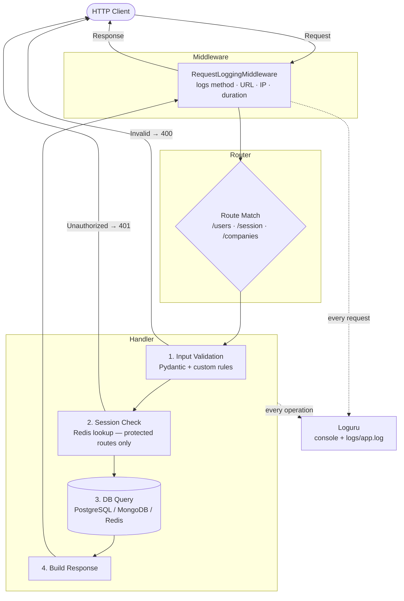
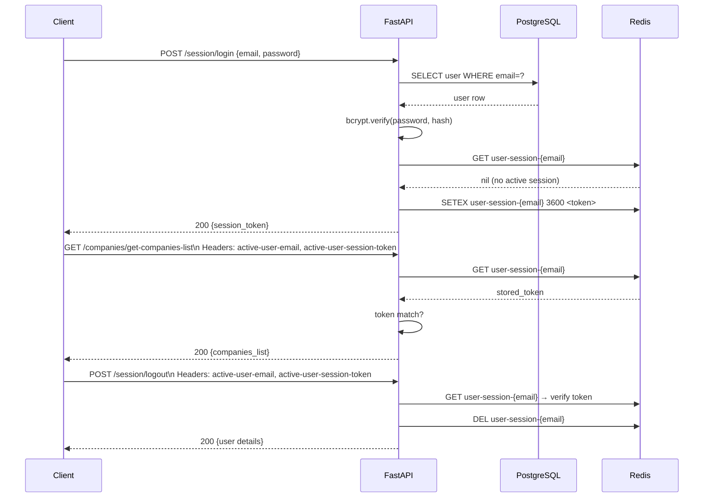
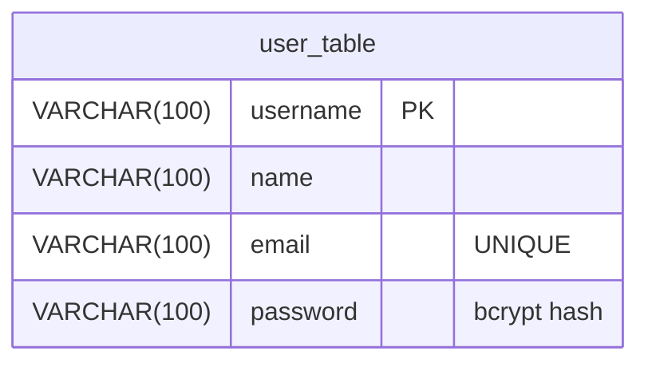

# User Management Service

A production-ready FastAPI microservice for user and company management backed by PostgreSQL, MongoDB, and Redis.

- **Base URL**: `http://localhost:52243`
- **Interactive Docs**: `http://localhost:52243/docs`

---

## Tech Stack

| Layer           | Technology              | Version   | Purpose                                |
|-----------------|-------------------------|-----------|----------------------------------------|
| Framework       | FastAPI                 | 0.115.12  | HTTP API, routing, validation          |
| ASGI Server     | Uvicorn                 | 0.34.0    | Runs the FastAPI application           |
| Primary DB      | PostgreSQL              | —         | User data storage                      |
| ORM             | SQLAlchemy              | 2.0.40    | PostgreSQL ORM (2.0 async-ready API)   |
| DB Adapter      | psycopg2-binary         | 2.9.10    | PostgreSQL driver                      |
| Document DB     | MongoDB                 | —         | Company records storage                |
| Mongo Driver    | PyMongo                 | 4.10.1    | MongoDB client                         |
| Cache / Session | Redis                   | —         | Session token storage (TTL-based)      |
| Redis Driver    | redis-py                | 5.2.1     | Redis client                           |
| Validation      | Pydantic                | 2.11.3    | Request/response schema validation     |
| Config          | pydantic-settings       | 2.9.1     | Environment-based configuration        |
| Password Hash   | bcrypt                  | 4.3.0     | Secure password hashing                |
| Logging         | Loguru                  | 0.7.3     | Structured logging to console + file   |
| Env Loader      | python-dotenv           | 1.1.0     | `.env` file loading                    |

---

## Project Structure

```
fast-api-revision/
├── app/
│   ├── main.py                   # App entry point, middleware, router registration
│   ├── config.py                 # Pydantic Settings (reads .env)
│   ├── database.py               # SQLAlchemy engine + get_db() dependency
│   ├── mongo_client.py           # MongoDB client + get_mongo_db() dependency
│   ├── redis_client.py           # Redis client + get_redis() dependency
│   ├── data/
│   │   └── companies.json        # Seed data for MongoDB
│   ├── middleware/
│   │   └── logging_middleware.py # HTTP request/response logging
│   ├── models/
│   │   └── user.py               # SQLAlchemy ORM model (user_table)
│   ├── schemas/
│   │   ├── user.py               # User request/response Pydantic schemas
│   │   ├── session.py            # Login/logout Pydantic schemas
│   │   └── company.py            # Company Pydantic schemas
│   ├── routers/
│   │   ├── user.py               # /users router
│   │   ├── session.py            # /session router
│   │   ├── company.py            # /companies router
│   │   └── handlers/             # One file per endpoint
│   │       ├── create_user.py
│   │       ├── get_user.py
│   │       ├── update_user.py
│   │       ├── delete_user.py
│   │       ├── get_user_list.py
│   │       ├── login.py
│   │       ├── logout.py
│   │       └── get_companies_list.py
│   └── utils/
│       ├── logger.py             # Loguru configuration
│       ├── security.py           # hash_password(), verify_password()
│       └── validators.py         # EMAIL_REGEX pattern
├── setup.py                      # One-time DB + collection setup
├── requirements.txt
└── .env                          # Environment variables (not committed)
```

---

## Quick Start

```bash
# 1. Create and activate virtual environment
python3 -m venv venv && source venv/bin/activate

# 2. Install dependencies
pip install -r requirements.txt

# 3. Configure environment (edit .env)
cp .env.example .env   # or create .env manually (see env vars below)

# 4. One-time DB setup (creates tables, indexes, seeds MongoDB)
python setup.py

# 5. Start the server
uvicorn app.main:app --host 0.0.0.0 --port 52243 --reload
```

### Environment Variables

| Variable        | Default       | Description                  |
|-----------------|---------------|------------------------------|
| `DB_HOST`       | `localhost`   | PostgreSQL host              |
| `DB_PORT`       | `5432`        | PostgreSQL port              |
| `DB_NAME`       | `postgres`    | PostgreSQL database name     |
| `DB_USER`       | `postgres`    | PostgreSQL username          |
| `DB_PASSWORD`   | `postgres`    | PostgreSQL password          |
| `SERVER_PORT`   | `52243`       | Uvicorn listen port          |
| `REDIS_HOST`    | `localhost`   | Redis host                   |
| `REDIS_PORT`    | `6379`        | Redis port                   |
| `MONGO_HOST`    | `localhost`   | MongoDB host                 |
| `MONGO_PORT`    | `27017`       | MongoDB port                 |
| `MONGO_DB_NAME` | `companies_db`| MongoDB database name        |

---

## Request Flow



### Logging Flow

- **Every request** → logged by `RequestLoggingMiddleware` (method, URL, client IP)
- **Every response** → logged with status code and duration in ms
- **Business events** → logged inside each handler (create, update, login, etc.)
- **Sensitive data** → passwords and session tokens are **never** logged
- **Log sinks**: colored stdout (DEBUG+) and `logs/app.log` (DEBUG+, 10 MB rotation, 10-day retention)

### Session Flow (Login → Protected API → Logout)



---

## Databases & Schemas

### PostgreSQL — `user_table`



| Column     | Type         | Constraint       | Notes                              |
|------------|--------------|------------------|------------------------------------|
| `username` | VARCHAR(100) | PRIMARY KEY      | Immutable login handle             |
| `name`     | VARCHAR(100) | NOT NULL         | Display name, 3–100 chars          |
| `email`    | VARCHAR(100) | UNIQUE, NOT NULL | Validated via regex before insert  |
| `password` | VARCHAR(100) | NOT NULL         | bcrypt hash — never returned in API|

**Connection pool**: size=10, max_overflow=20, pre_ping=True

---

### MongoDB — `companies_db.companies_collection`

**Required field**: `domain` (unique index)

**Sample document**:
```json
{
  "domain": ".icecom",
  "companyName": "Ice Limited",
  "companyCategory": "Business And Industrial",
  "city": "Surbiton",
  "state": "SRY",
  "zipcode": "KT5",
  "country": "GB"
}
```

**Collection schema** (`domain` required, all others optional strings):

| Field             | Type   | Required | Index               |
|-------------------|--------|----------|---------------------|
| `domain`          | string | Yes      | Unique (`idx_domain_unique`) |
| `companyName`     | string | No       | —                   |
| `companyCategory` | string | No       | `idx_company_category` |
| `city`            | string | No       | —                   |
| `state`           | string | No       | —                   |
| `country`         | string | No       | `idx_country`       |
| `zipcode`         | string | No       | —                   |

> `_id` (ObjectId) is auto-generated and excluded from all API responses.

---

### Redis — Session Storage

| Key                       | Value                       | TTL    | Set on | Deleted on |
|---------------------------|-----------------------------|--------|--------|------------|
| `user-session-{email}`    | 64-char hex token           | 3600 s | Login  | Logout     |

**Commands used**:
- `SETEX key 3600 token` → store session on login
- `GET key` → validate session on protected routes
- `DEL key` → invalidate session on logout

---

## API Reference

### Summary

| Method   | Endpoint                            | Auth Required | Description                |
|----------|-------------------------------------|:-------------:|----------------------------|
| `POST`   | `/users/create-user`                | No            | Register a new user        |
| `GET`    | `/users/get-user/{username}`        | No            | Fetch user by username     |
| `POST`   | `/users/update-user/{username}`     | No            | Update user fields         |
| `DELETE` | `/users/delete-user/{username}`     | No            | Delete a user              |
| `GET`    | `/users/get-user-list`              | No            | Paginated user listing     |
| `POST`   | `/session/login`                    | No            | Login, get session token   |
| `POST`   | `/session/logout`                   | Session token | Logout, destroy session    |
| `GET`    | `/companies/get-companies-list`     | Session token | Paginated company listing  |
| `GET`    | `/health`                           | No            | Liveness probe             |

> **Auth Required** = both `active-user-email` and `active-user-session-token` headers must be sent.

---

### POST `/users/create-user`

**Request body**

| Field      | Type   | Required | Rules                       |
|------------|--------|----------|-----------------------------|
| `name`     | string | Yes      | 3–100 chars                 |
| `email`    | string | Yes      | Valid email, unique         |
| `username` | string | Yes      | Non-empty, unique           |
| `password` | string | Yes      | Min 8 chars                 |

**Responses**

| Status | Meaning                          |
|--------|----------------------------------|
| 201    | User created                     |
| 400    | Validation error (all errors returned at once) |
| 409    | Username or email already exists |

**Success response (201)**
```json
{
  "name": "Jane Doe",
  "email": "jane@example.com",
  "username": "janedoe",
  "message": "User created successfully"
}
```

**curl**
```bash
curl -s -X POST http://localhost:52243/users/create-user \
  -H "Content-Type: application/json" \
  -d '{
    "name": "Jane Doe",
    "email": "jane@example.com",
    "username": "janedoe",
    "password": "secret123"
  }' | python3 -m json.tool
```

---

### GET `/users/get-user/{username}`

**Path parameter**: `username` (string)

**Responses**

| Status | Meaning       |
|--------|---------------|
| 200    | User found    |
| 404    | User not found|

**Success response (200)**
```json
{
  "name": "Jane Doe",
  "email": "jane@example.com",
  "username": "janedoe",
  "message": "User fetched successfully"
}
```

**curl**
```bash
curl -s http://localhost:52243/users/get-user/janedoe | python3 -m json.tool
```

---

### POST `/users/update-user/{username}`

**Path parameter**: `username` (string)

**Request body** — at least one field required, all optional

| Field      | Type   | Rules                              |
|------------|--------|------------------------------------|
| `name`     | string | 3–100 chars                        |
| `email`    | string | Valid email, unique across users   |
| `password` | string | Min 8 chars (stored as bcrypt hash)|

**Responses**

| Status | Meaning                                 |
|--------|-----------------------------------------|
| 200    | User updated                            |
| 400    | No fields provided or validation errors |
| 404    | User not found                          |
| 409    | New email already in use                |

**Success response (200)**
```json
{
  "name": "Jane Doe",
  "email": "jane_new@example.com",
  "username": "janedoe",
  "message": "User updated successfully"
}
```

**curl**
```bash
curl -s -X POST http://localhost:52243/users/update-user/janedoe \
  -H "Content-Type: application/json" \
  -d '{"email": "jane_new@example.com"}' | python3 -m json.tool
```

---

### DELETE `/users/delete-user/{username}`

**Path parameter**: `username` (string)

**Responses**

| Status | Meaning        |
|--------|----------------|
| 200    | User deleted   |
| 404    | User not found |

**Success response (200)**
```json
{
  "name": "Jane Doe",
  "email": "jane@example.com",
  "username": "janedoe",
  "message": "User deleted successfully"
}
```

**curl**
```bash
curl -s -X DELETE http://localhost:52243/users/delete-user/janedoe | python3 -m json.tool
```

---

### GET `/users/get-user-list`

**Query parameters**

| Param   | Type | Default | Rules      |
|---------|------|---------|------------|
| `skip`  | int  | 0       | Must be ≥ 0|
| `limit` | int  | 5       | Must be > 0|

**Responses**

| Status | Meaning                        |
|--------|--------------------------------|
| 200    | List returned                  |
| 400    | Invalid pagination parameters  |

**Success response (200)**
```json
{
  "user_list": [
    { "name": "Alice", "email": "alice@example.com", "username": "alice" },
    { "name": "Jane Doe", "email": "jane@example.com", "username": "janedoe" }
  ],
  "total_count": 12,
  "message": "User list fetched successfully"
}
```

> Results are ordered alphabetically by `name` (ASC). `total_count` is the total across all pages.

**curl**
```bash
curl -s "http://localhost:52243/users/get-user-list?skip=0&limit=10" | python3 -m json.tool
```

---

### POST `/session/login`

**Request body** — one of `username` or `email` is required

| Field      | Type   | Required | Rules                    |
|------------|--------|----------|--------------------------|
| `username` | string | No*      | Non-empty if provided    |
| `email`    | string | No*      | Valid email if provided  |
| `password` | string | Yes      | Min 8 chars              |

\* At least one of `username` or `email` must be provided. If both are given, `email` takes precedence.

**Responses**

| Status | Meaning                               |
|--------|---------------------------------------|
| 200    | Login successful, session token issued |
| 400    | Validation error                      |
| 401    | Wrong password                        |
| 404    | User not found                        |
| 409    | Active session already exists         |

**Success response (200)**
```json
{
  "name": "Jane Doe",
  "email": "jane@example.com",
  "username": "janedoe",
  "session_token": "a3f1c8...64hexchars",
  "message": "Logged in successfully"
}
```

**curl**
```bash
curl -s -X POST http://localhost:52243/session/login \
  -H "Content-Type: application/json" \
  -d '{"email": "jane@example.com", "password": "secret123"}' | python3 -m json.tool
```

---

### POST `/session/logout`

**Required headers**

| Header                      | Description                           |
|-----------------------------|---------------------------------------|
| `active-user-email`         | Email of the logged-in user           |
| `active-user-session-token` | Token received from `/session/login`  |

**Responses**

| Status | Meaning                                  |
|--------|------------------------------------------|
| 200    | Logged out, session destroyed            |
| 400    | Missing required headers                 |
| 401    | No active session or token mismatch      |
| 404    | User not found                           |

**Success response (200)**
```json
{
  "name": "Jane Doe",
  "email": "jane@example.com",
  "username": "janedoe",
  "message": "Logged out successfully"
}
```

**curl**
```bash
curl -s -X POST http://localhost:52243/session/logout \
  -H "active-user-email: jane@example.com" \
  -H "active-user-session-token: a3f1c8...64hexchars" | python3 -m json.tool
```

---

### GET `/companies/get-companies-list`

**Required headers**

| Header                      | Description                          |
|-----------------------------|--------------------------------------|
| `active-user-email`         | Email of the authenticated user      |
| `active-user-session-token` | Valid session token from login       |

**Query parameters**

| Param   | Type | Default | Rules      |
|---------|------|---------|------------|
| `skip`  | int  | 0       | Must be ≥ 0|
| `limit` | int  | 5       | Must be > 0|

**Responses**

| Status | Meaning                               |
|--------|---------------------------------------|
| 200    | Company list returned                 |
| 400    | Missing headers or invalid pagination |
| 401    | No active session or token mismatch   |

**Success response (200)**
```json
{
  "companies_list": [
    {
      "domain": ".icecom",
      "companyName": "Ice Limited",
      "companyCategory": "Business And Industrial",
      "city": "Surbiton",
      "state": "SRY",
      "country": "GB",
      "zipcode": "KT5"
    }
  ],
  "total_count": 1500,
  "message": "Companies list fetched successfully"
}
```

**curl**
```bash
curl -s "http://localhost:52243/companies/get-companies-list?skip=0&limit=5" \
  -H "active-user-email: jane@example.com" \
  -H "active-user-session-token: a3f1c8...64hexchars" | python3 -m json.tool
```

---

### GET `/health`

**curl**
```bash
curl -s http://localhost:52243/health
# → {"status": "ok"}
```

---

## Validation Rules

| Field      | Endpoint          | Rules                                          |
|------------|-------------------|------------------------------------------------|
| `name`     | create, update    | 3–100 chars, non-empty                         |
| `email`    | create, update, login | Regex: `^[a-z0-9._%+\-]+@[a-z0-9.\-]+\.[a-z]{2,}$`, unique |
| `username` | create            | Non-empty, unique                              |
| `password` | create, update, login | Min 8 chars (stored as bcrypt hash)        |
| `skip`     | list endpoints    | Integer ≥ 0                                    |
| `limit`    | list endpoints    | Integer > 0                                    |

> **Fail-all validation**: all field errors are collected and returned together in a single `{"errors": [...]}` response — no multiple round-trips needed.

---

## Error Response Format

All `4xx` errors follow this shape:

```json
{ "errors": ["error message 1", "error message 2"] }
```

Single-error endpoints (e.g. 404) use:

```json
{ "detail": "User not found" }
```
